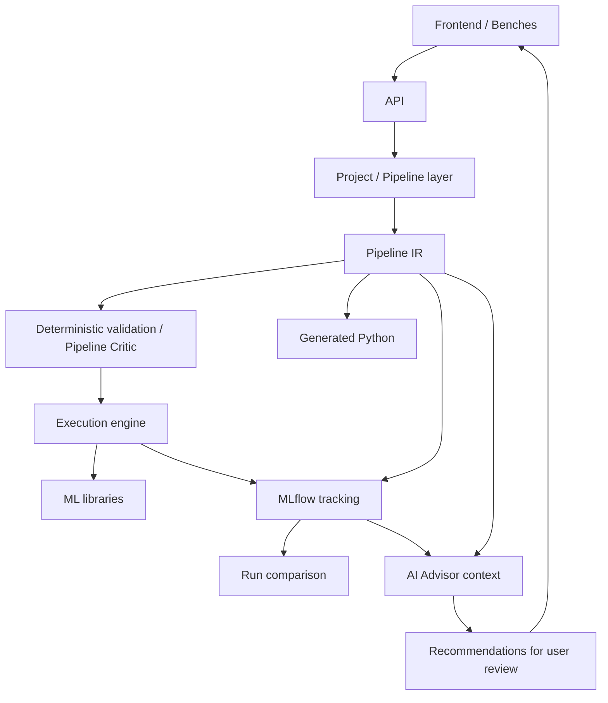

# Proposed architecture

**Status:** design direction only. No components are implemented. The decision to
use a Pipeline IR is [accepted](decisions/0001-use-pipeline-ir.md); its exact schema
and the rest of the technology choices remain open.



This diagram describes responsibilities, not separate deployed services. Prefer
the simplest local application that validates the product. No Redis, Celery,
Kafka, Kubernetes, or microservice architecture is currently justified.

## Shared representation and execution

Benches should produce explicit Pipeline operations rather than independently
mutating datasets. The Project/Pipeline layer should own validated state and
coordinate execution. Dataset identity, ordered transformations, split semantics,
column roles, seeds, and versioning need deliberate IR design. No JSON example
is a finalized contract.

The execution engine should map supported operations to mature ML libraries.
Fit preprocessing only on training data, then apply the fitted transformations
to held-out data. Validation should cover the correctness risks in the
[prototype](prototype.md). Execution and generated Python must derive from the
same Pipeline semantics and be checked for parity.

One-way generation of managed Python is the early transparency model. Readable,
independently runnable code is the objective; arbitrary Python parsing and
visual round trips are out of scope. Explicit extension points may come later.

## Technology direction

| Responsibility | Proposed direction | Decision state |
| --- | --- | --- |
| Frontend | React/Next.js, TypeScript | Framework and packaging unselected |
| API and validation | Python, FastAPI, Pydantic | Proposed; no dependencies installed |
| Dataframes and ML | pandas or equivalent, scikit-learn, XGBoost | Intended ecosystem; versions unselected |
| Experiment tracking | MLflow | Intended prototype integration; storage/topology open |
| Optimization | Optuna | Later, outside initial baseline work |

Project persistence, file layout, background execution lifecycle, cancellation,
dataset versioning, resource limits, local packaging, and container strategy
remain open. An eventual `docker compose up` experience is a goal, not a working
command. Choose infrastructure only after identifying a concrete requirement.

## Experiment tracking versus application logging

Application logs answer **“Why did this operation fail?”** MLflow answers
**“What happened during this ML Experiment?”** Neither replaces the other.

MLflow should record Run ID, dataset identity/version, Pipeline configuration,
model, hyperparameters, random seed, metrics, artifacts, relevant plots, and
environment/version information. Comparison should use this recorded state.
Do not build a custom tracker unless a future ADR changes this direction.
Artifact content, access, retention, and dataset availability need explicit design.

Application logging should eventually be structured, using events such as:

```text
project_created          dataset_uploaded        dataset_profiled
pipeline_updated         pipeline_validation_failed
training_started         training_completed      training_failed
experiment_logged        ai_request_started      ai_request_completed
ai_request_failed
```

Use correlation identifiers to connect operations and Runs. Logs must not
casually include raw dataset rows, credentials, API keys, authorization headers,
connection strings, uploaded file contents, sensitive feature values, or complete
AI prompts containing sensitive data. Error payloads and artifacts need the same
care as normal messages.

AI telemetry should prefer provider, model, latency, token usage, request ID,
and success/failure metadata. These are design requirements, not implemented
redaction guarantees.

## AI boundaries

The AI Advisor's structured context may include problem statement, task, target,
dataset schema, semantic feature types, profiling results, current Pipeline,
preprocessing, model, hyperparameters, previous Runs, evaluation results, and
deterministic warnings. Raw rows are not needed by default.

The intended roles are Advisor, Critic, and Teacher. Recommendations should
include reason, evidence, confidence, and alternatives. An AI critique is
advisory; the deterministic Pipeline Critic remains authoritative for execution
validation. No AI output may silently change state or bypass validation.

Provider choice, context filtering, explicit consent for remote data sharing,
and unavailable-provider behavior remain undecided. Core execution should remain
usable without AI. An Experimenter capability is future exploration only.

## Local execution boundary

Workloads inherit the permissions of their local runtime/container. No sandbox
is implemented or promised, and this is not a secure multi-tenant execution
platform. Keep development instances off untrusted networks. See
[security assumptions and reporting](../SECURITY.md).

## Vocabulary

| Term | Meaning in these documents |
| --- | --- |
| Project | Problem statement, task, target/objective, and related work |
| Bench | Specialized workspace for a stage of the workflow |
| Pipeline | Explicit, reproducible sequence/configuration of ML operations |
| Pipeline IR | Structured representation shared across Pipeline consumers |
| Run | One execution of a configured Pipeline |
| Experiment | Related Runs used to investigate a Project question; exact grouping remains open |
| AI Advisor | Advisory explanations grounded in structured Project facts |
| Pipeline Critic | Planned deterministic correctness checks and warnings |
